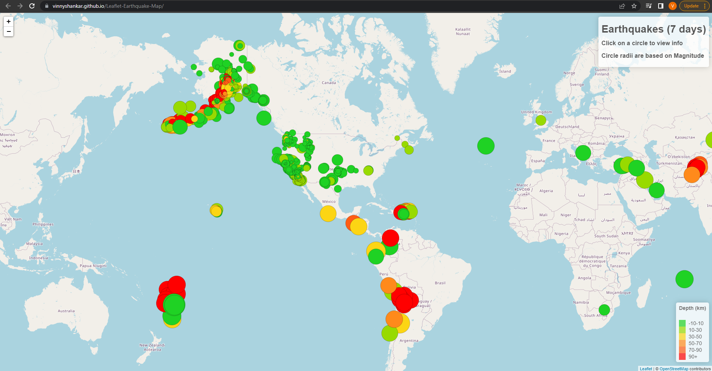
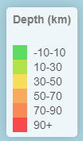
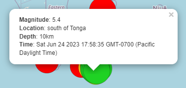
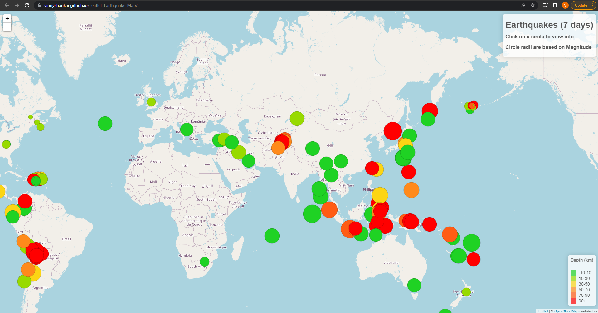

# Leaflet-Earthquake-Map
- Global earthquake map created using JavaScript, CSS, and HTML
### - Overview
    - Data Source: [United States Geological Survey](https://earthquake.usgs.gov/earthquakes/feed/v1.0/geojson.php)
### - Contents
- One `static/js` directory containing:
    * A `logic.js` file with the JavaScript code
- One `static/css` directory containing:
    * A `style.css` file with the CSS code

- One `index.html` file containing the HTML
- One images directory containing screenshots of the deployed page
- This README.md file
### - Description
* This is a Leaflet map visualization of the last 7 days of earthquake data provided in GeoJSON format by the [United States Geological Survey](https://earthquake.usgs.gov/earthquakes/feed/v1.0/geojson.php)
### - Visualization
* The code renders a circle at the coordinates for each earthquake
* Each circle's radius is proportional to the earthquake magnitude. The higher the magnitude, the longer the circle radius.         

* Each circle's color is based on the earthquake depth in kilometers           

* The user can click on each circle to launch a tooltip that displays the magnitude, location, depth, and time of the earthquake.           

* The user can zoom in and  out of the map using buttons or the scroll wheel. In addition, the user can click and drag the map to view other parts of the world.            

